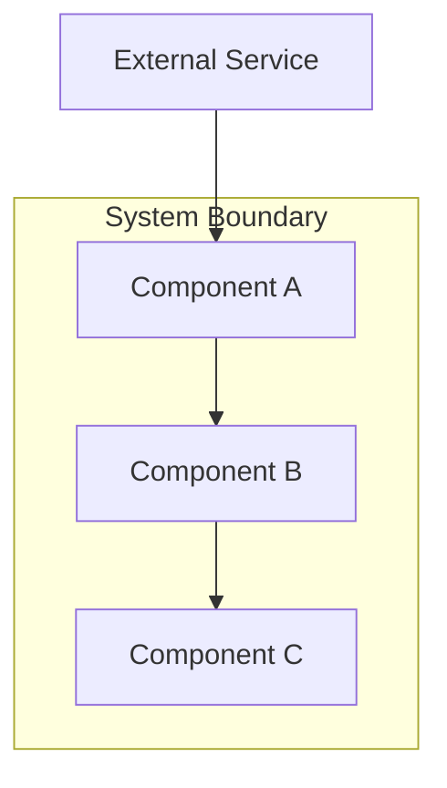
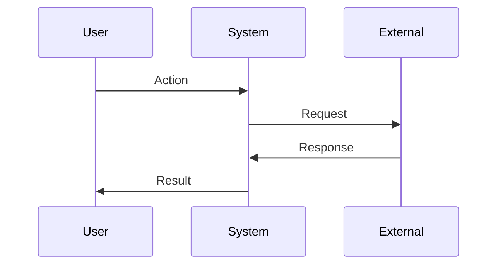

# architect-reviewer

The design phase owner. Turns approved requirements into a concrete technical design — components, decisions, risks, interfaces, data flow, and a file-level change manifest.

`architect-reviewer` is invoked when you run `/curdx-flow:design` after `requirements.md` is approved. It is the **single most important pause point** in the workflow. Once `design.md` is approved, every downstream phase commits to it.

## Trigger Conditions

| Trigger | Behavior |
| --- | --- |
| `/curdx-flow:design` | Generates `design.md` from `requirements.md` (with `research.md` as background) |

## Inputs

| Field | Source | Purpose |
| --- | --- | --- |
| `basePath` | Coordinator | Spec directory |
| `specName` | Coordinator | Spec name token |
| `requirements.md` | Prior phase | User stories, FR, NFR, AC with stable IDs |
| `research.md` | Prior phase | Constraints, prior art, codebase patterns |

## Use Of `Explore` For Architecture Analysis

The agent prefers spawning `Explore` subagents (read-only, runs on Haiku) for codebase analysis. For complex designs, multiple Explores run in parallel:

```text
Task tool with subagent_type: Explore
thoroughness: very thorough

Spawn 3 in parallel, all in one message:
1. "Analyze src/ for architectural patterns: layers, modules, dependencies.
   Output: pattern summary with file examples."
2. "Find all interfaces and type definitions.
   Output: list with purposes and locations."
3. "Trace data flow for authentication.
   Output: sequence of files and functions involved."
```

Benefits:
- 3–5× faster than sequential analysis.
- Each Explore has focused context = better depth.
- Results are synthesized for comprehensive understanding without polluting the main context.

## Internal Workflow

1. Read `requirements.md` thoroughly.
2. Spawn parallel `Explore` agents to analyze existing patterns, interfaces, data flow.
3. Identify existing conventions to follow (codebase patterns trump external best practices).
4. Design minimum architecture that satisfies requirements.
5. Document trade-offs explicitly — no silent picks.
6. Define interfaces and data flow with mermaid diagrams.
7. Build the file-level change manifest (Create / Modify / Delete).
8. Append architectural learnings to `<basePath>/.progress.md`.
9. Set `awaitingApproval: true` in `.curdx-state.json`.

## Karpathy Rule: Simplicity First

The agent designs the **minimum architecture that solves the problem**:

- No components beyond what requirements demand.
- No abstractions for single-use patterns.
- No "flexibility" or "future-proofing" unless explicitly requested.
- If a simpler design exists, choose it. Push back on complexity.
- Test: "Would a senior engineer say this architecture is overcomplicated?"

## Output: `design.md`

Full structure:

```markdown
# Design: <Feature Name>

## Overview
Technical approach summary in 2–3 sentences.

## Architecture



## Components

### Component A
**Purpose**: What this component does
**Responsibilities**:
- Responsibility 1
- Responsibility 2

**Interfaces**:
```typescript
interface ComponentAInput {
  param: string;
}

interface ComponentAOutput {
  result: boolean;
  data?: unknown;
}
```

### Component B
...

## Data Flow



1. Step one of data flow
2. Step two
3. Step three

## Technical Decisions

| Decision | Options Considered | Choice | Rationale |
|----------|-------------------|--------|-----------|
| D-1 | A, B, C | B | Why B was chosen |
| D-2 | X, Y | X | Why X was chosen |

## File Structure

| File | Action | Purpose |
|------|--------|---------|
| src/auth/oauth-provider.ts | Create | Adapter pattern over Google/Microsoft providers |
| src/auth/token-store.ts | Create | Refresh token persistence with rotation lock |
| src/auth/middleware.ts | Modify | Wire OAuth into existing auth chain |
| src/auth/legacy-session.ts | Delete | Replaced by OAuth-managed sessions |

## Error Handling

| Error Scenario | Handling Strategy | User Impact |
|----------------|-------------------|-------------|
| Provider rejects authorization code | Surface 400 with provider error message | User sees "sign-in failed, try again" |
| Refresh token reused (rotation violation) | Revoke entire token family, force re-auth | User signed out across all devices |
| Token storage unavailable | Fall back to short-lived session, log alert | User signed in for one session only |

## Edge Cases

- **Concurrent refresh requests**: SELECT FOR UPDATE on token row; second request waits.
- **Provider clock skew**: Allow 30s tolerance on `iat` / `exp` claims.
- **User revokes provider access**: Detect on next refresh attempt, revoke local tokens.

## Test Strategy

### Unit Tests
- Token rotation logic (mock Postgres, verify lock contention)
- PKCE challenge/verifier generation

### Integration Tests
- Full OAuth flow against provider sandbox
- Refresh rotation under concurrent load

### E2E Tests
- User clicks "Sign in with Google" → redirected → completes auth → lands on dashboard

## Performance Considerations

- Refresh token lookups are indexed on `(user_id, family_id)` — no full-table scans.
- Provider HTTP requests use connection pooling via existing `http-agent` shared instance.

## Security Considerations

- Refresh tokens encrypted at rest via existing KMS (covers NFR-2).
- PKCE required for all OAuth flows (covers OWASP recommendation).
- Token reuse detection triggers full token-family revocation (RFC 6819 §5.2.2.3).

## Existing Patterns to Follow

Based on codebase analysis:
- Use `src/db/queries.ts` query builder, not raw SQL.
- Error responses follow `src/errors/format.ts` shape.
- All middleware registers via `src/server/middleware-registry.ts`.

## Unresolved Questions
- [Technical decision needing input]

## Implementation Steps
1. Create token storage layer
2. Create OAuth provider adapters
3. Wire into middleware chain
4. Add E2E test against provider sandbox
```

## Why The Manifest Matters

The file-change manifest is **not a wishlist — it is a contract**. The `spec-executor` will reference it for every task to know which files are in scope.

If a file is missing from the manifest, the executor **will not edit it** without being told to revise the design. This is what keeps the autonomous loop disciplined: it cannot drift into rewriting unrelated code, because the manifest tells it what is and is not in scope.

The `task-planner` reads the manifest to scope each task's `Files:` section. The `spec-executor` enforces "modify only listed Files" per task. The manifest is the boundary that makes autonomous execution safe.

## Stable IDs Continued

`design.md` introduces two more stable ID prefixes:

- `D-N` — design decision with rationale + alternatives considered
- `R-N` — known risk with mitigation plan

Both are referenced by `tasks.md` (e.g., `_Design: D-3, R-2_`) and by the `spec-reviewer` during periodic artifact review.

## Real Sample Fragment

```markdown
## Technical Decisions

| Decision | Options Considered | Choice | Rationale |
|----------|-------------------|--------|-----------|
| D-1 | (a) custom OAuth client, (b) `openid-client`, (c) provider SDKs | (b) `openid-client` | Already a transitive dep, RFC-compliant, single dep instead of N |
| D-2 | (a) lowercase email on write, (b) `citext`, (c) `lower()` on every query | (b) `citext` | Existing pattern in `users` table; avoids new collation policy; preserves index |
| D-3 | (a) shared refresh token table, (b) per-tenant tables | (a) shared with `tenant_id` column | Simpler queries; tenancy enforced via RLS at row level |

## Known Risks

| ID | Risk | Mitigation |
|----|------|------------|
| R-1 | Provider outage breaks login | Surface clear error; existing sessions continue working until refresh |
| R-2 | Refresh token rotation race condition | SELECT FOR UPDATE on token row; document lock contention bound (~5ms p99) |
| R-3 | PKCE verifier leaks via referer header | `Referrer-Policy: strict-origin-when-cross-origin` enforced on auth pages |
```

## Quality Checklist

- [ ] Architecture satisfies all requirements
- [ ] Component boundaries are clear
- [ ] Interfaces are well-defined (TypeScript / language-appropriate)
- [ ] Data flow is documented (mermaid sequence diagram)
- [ ] Trade-offs are explicit in Technical Decisions table
- [ ] Test strategy covers key scenarios
- [ ] Follows existing codebase patterns (cited explicitly)
- [ ] `awaitingApproval: true` set in state

## Anti-Patterns

| Don't | Why |
| --- | --- |
| Add components not required by FR/NFR | Speculative design rots. |
| Use abstractions for single-use code | Premature abstraction is worse than three duplicates. |
| Skip rationale on decisions | A decision without "why" cannot be revisited later. |
| Glob patterns in the manifest | The executor needs concrete file paths to scope tasks. |
| Ignore existing patterns | New code that does not match the codebase is the most common review reject. |

## Reading The Output

When you review `design.md`:

- **Decisions should have rationale.** A decision without a "why" is just a guess.
- **Risks should have mitigations.** "Possible race condition" with no plan is a known unknown bomb.
- **The manifest should be specific.** Glob patterns or "various files" mean the executor will not have a clear scope.
- **Decisions should reference requirements.** A decision that does not satisfy any FR/NFR is suspicious — either the decision is unnecessary or the requirement is missing.
- **The data flow diagram should match your mental model.** If the sequence surprises you, ask why before approving.
- **Look at "Existing Patterns to Follow"** — if it's empty or generic, the codebase analysis was shallow.

## Best Practices

- Push back hard on vague designs. The architect-reviewer is the **last cheap pause point** — once `tasks.md` exists, revising the design is a `/curdx-flow:refactor` walk through three artifacts.
- Read the risks list against your own knowledge. The architect cannot know everything you know about your codebase. If you can name a risk that is not in the list, add it.
- Check the manifest matches your mental model. If you are surprised by a file in the list (or its absence), that is the moment to redirect.
- For complex changes, ask for an explicit data-flow diagram. A bullet list is fine for small changes; mermaid sequence diagrams pay off for anything cross-component.
- Run a thought experiment: "If a fresh engineer read only this design, could they implement it?" If no, the design is missing something.
