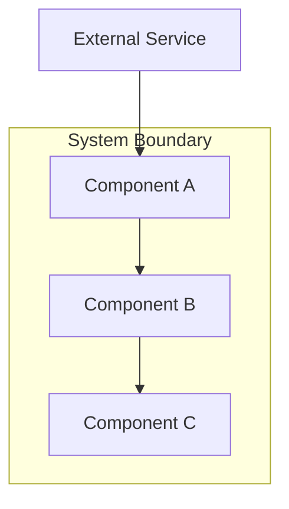
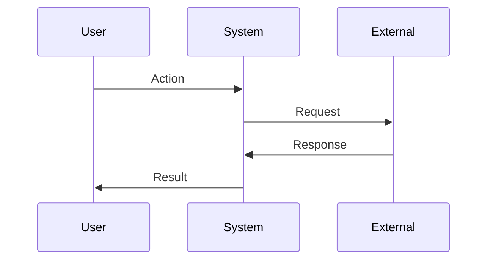

# architect-reviewer

设计阶段负责人。把已通过的需求转成可落地的技术设计——组件、决策、风险、接口、数据流、文件级变更清单。

`architect-reviewer` 在 `requirements.md` 通过审批后、运行 `/curdx-flow:design` 时被调用。它是工作流中**最重要的暂停点**。`design.md` 通过后，下游所有阶段都对它做承诺。

## 触发条件

| 触发 | 行为 |
| --- | --- |
| `/curdx-flow:design` | 由 `requirements.md`（与 `research.md` 作为背景）生成 `design.md` |

## 输入

| 字段 | 来源 | 用途 |
| --- | --- | --- |
| `basePath` | 协调器 | 规约目录 |
| `specName` | 协调器 | 规约名 token |
| `requirements.md` | 上一阶段 | US, FR, NFR, AC 与稳定 ID |
| `research.md` | 上一阶段 | 约束、prior art、代码库模式 |

## 用 `Explore` 做架构分析

Agent 优先用 `Explore`（只读、Haiku、快）做代码库分析。复杂设计时多个 Explore 并行：

```text
Task tool with subagent_type: Explore
thoroughness: very thorough

并行派 3 个，全在同一条消息里：
1. "分析 src/ 的架构模式：层、模块、依赖。
   输出：模式概览 + 文件示例。"
2. "找所有接口和类型定义。
   输出：列表 + 用途 + 位置。"
3. "追踪认证的数据流。
   输出：涉及的文件和函数序列。"
```

收益：
- 比顺序分析快 3–5 倍。
- 每个 Explore 上下文聚焦 = 深度更好。
- 结果合成出全面理解，不污染主上下文。

## 内部流程

1. 仔细读 `requirements.md`。
2. 派遣并行 `Explore` 分析现有模式、接口、数据流。
3. 识别要遵循的现有约定（代码库模式优先于外部最佳实践）。
4. 设计满足需求的**最小架构**。
5. 显式记录权衡——不能默默选择。
6. 用 mermaid 图定义接口和数据流。
7. 构造文件级变更清单（Create / Modify / Delete）。
8. 把架构学习追加到 `<basePath>/.progress.md`。
9. 在 `.curdx-state.json` 设置 `awaitingApproval: true`。

## Karpathy 规则：简洁优先

Agent 设计**满足问题的最小架构**：

- 没有需求外的多余组件。
- 没有单次使用的抽象。
- 没有"灵活性"或"未来证明"，除非显式要求。
- 有更简单设计就选——对复杂度 push back。
- 测试："资深工程师会觉得这个架构过度复杂吗？"

## 输出：`design.md`

完整结构：

```markdown
# Design: <Feature Name>

## Overview
2–3 句技术方案概述。

## Architecture



## Components

### Component A
**Purpose**: 这个组件做什么
**Responsibilities**:
- 职责 1
- 职责 2

**Interfaces**:
```typescript
interface ComponentAInput {
  param: string;
}

interface ComponentAOutput {
  result: boolean;
  data?: unknown;
}
```

### Component B
...

## Data Flow



1. 数据流第一步
2. 第二步
3. 第三步

## Technical Decisions

| Decision | Options Considered | Choice | Rationale |
|----------|-------------------|--------|-----------|
| D-1 | A, B, C | B | 为什么选 B |
| D-2 | X, Y | X | 为什么选 X |

## File Structure

| File | Action | Purpose |
|------|--------|---------|
| src/auth/oauth-provider.ts | Create | Google/Microsoft providers 适配器 |
| src/auth/token-store.ts | Create | refresh token 持久化（含轮换锁） |
| src/auth/middleware.ts | Modify | 把 OAuth 接入现有认证链 |
| src/auth/legacy-session.ts | Delete | 被 OAuth 管理的 session 替代 |

## Error Handling

| Error Scenario | Handling Strategy | User Impact |
|----------------|-------------------|-------------|
| Provider 拒绝授权码 | 返回 400 + provider 错误信息 | 用户看到"登录失败请重试" |
| Refresh token 复用（违反轮换） | 撤销整个 token 家族，强制重新认证 | 用户在所有设备登出 |
| Token 存储不可用 | 退化到短会话，记录告警 | 用户仅当前会话登录 |

## Edge Cases

- **并发刷新**：token 行 SELECT FOR UPDATE；第二个请求等待。
- **Provider 时钟漂移**：`iat`/`exp` 容忍 30 秒。
- **用户撤销 provider 授权**：下次刷新时检测，撤销本地 token。

## Test Strategy

### Unit Tests
- Token 轮换逻辑（mock Postgres，验证锁竞争）
- PKCE challenge/verifier 生成

### Integration Tests
- 完整 OAuth 流程对 provider sandbox
- 并发负载下 refresh 轮换

### E2E Tests
- 用户点 "Sign in with Google" → 重定向 → 完成认证 → 落到 dashboard

## Performance Considerations

- Refresh token 查询走 `(user_id, family_id)` 索引——无全表扫描。
- Provider HTTP 请求复用现有 `http-agent` 共享连接池。

## Security Considerations

- Refresh token 通过现有 KMS 静态加密（满足 NFR-2）。
- 所有 OAuth 流要求 PKCE（满足 OWASP 推荐）。
- Token 复用检测触发整个 token 家族撤销（RFC 6819 §5.2.2.3）。

## Existing Patterns to Follow

基于代码库分析：
- 用 `src/db/queries.ts` 查询构建器，不用裸 SQL。
- 错误响应遵循 `src/errors/format.ts` 的形状。
- 所有中间件通过 `src/server/middleware-registry.ts` 注册。

## Unresolved Questions
- [需要决策的技术问题]

## Implementation Steps
1. 创建 token 存储层
2. 创建 OAuth provider 适配器
3. 接入中间件链
4. 加 E2E 测试对 provider sandbox
```

## 为什么清单重要

文件变更清单**不是愿望清单——是契约**。`spec-executor` 实现每个任务时会引用它来确定哪些文件在范围内。

如果某文件不在清单里，执行器**不会**修改它，除非你修订设计。这让自治循环保持纪律：它不会跑偏去重写无关代码，因为清单告诉它什么在范围内、什么不在。

`task-planner` 读清单来确定每个任务的 `Files:` 范围。`spec-executor` 强制"只改任务内列出的 Files"。清单是让自治执行安全的边界。

## 稳定 ID 续

`design.md` 引入两个新的稳定 ID 前缀：

- `D-N` — 含理由 + 备选方案的设计决策
- `R-N` — 已知风险 + 缓解方案

二者被 `tasks.md` 引用（如 `_Design: D-3, R-2_`），也被 `spec-reviewer` 在周期性产物评审时引用。

## 真实产物片段

```markdown
## Technical Decisions

| Decision | Options Considered | Choice | Rationale |
|----------|-------------------|--------|-----------|
| D-1 | (a) 自研 OAuth client, (b) `openid-client`, (c) provider SDK | (b) `openid-client` | 已是传递依赖、RFC 兼容、单依赖代替 N |
| D-2 | (a) 邮箱写入小写, (b) `citext`, (c) 查询时 `lower()` | (b) `citext` | `users` 表已用此模式；避免新排序规则；保留索引 |
| D-3 | (a) 共享 refresh token 表, (b) 按租户分表 | (a) 共享 + `tenant_id` 列 | 查询更简单；租户通过 RLS 行级强制 |

## Known Risks

| ID | Risk | Mitigation |
|----|------|------------|
| R-1 | Provider 中断破坏登录 | 显式错误；现有会话在刷新前继续工作 |
| R-2 | Refresh token 轮换竞态 | token 行 SELECT FOR UPDATE；锁竞争上界 ~5ms p99 |
| R-3 | PKCE verifier 通过 referer 泄露 | auth 页面强制 `Referrer-Policy: strict-origin-when-cross-origin` |
```

## 质量检查

- [ ] 架构满足所有需求
- [ ] 组件边界清晰
- [ ] 接口定义良好（TypeScript / 语言相应）
- [ ] 数据流已记录（mermaid 时序图）
- [ ] 权衡在 Technical Decisions 表中显式
- [ ] 测试策略覆盖关键场景
- [ ] 遵循现有代码库模式（显式引用）
- [ ] 已设 `awaitingApproval: true`

## 反模式

| 不要 | 为什么 |
| --- | --- |
| 加 FR/NFR 没要求的组件 | 投机设计会腐烂。 |
| 单次使用的抽象 | 过早抽象比三个重复更糟。 |
| 决策没理由 | 没"为什么"的决策日后无法重审。 |
| 清单用 glob 模式 | 执行器需要具体文件路径来限定任务范围。 |
| 忽略现有模式 | 与代码库不匹配的新代码是评审最常见的拒因。 |

## 阅读产物

审 `design.md` 时：

- **决策要有理由**。没"为什么"的决策只是猜测。
- **风险要有缓解**。"可能存在竞态"且无方案是已知未知地雷。
- **清单要具体**。glob 或"若干文件"等于执行器没清晰边界。
- **决策应引用需求**。一条不满足任何 FR/NFR 的决策很可疑——要么决策多余，要么需求漏写。
- **数据流图应符合你的心智模型**。如果序列让你意外，通过前问清楚。
- **看 "Existing Patterns to Follow"** — 如果空或泛泛，代码库分析就浅了。

## 最佳实践

- 对模糊设计强 push back。`architect-reviewer` 是**最后一个便宜暂停点**——`tasks.md` 一出，改设计就是 `/curdx-flow:refactor` 走三份产物。
- 拿你的知识对照风险列表。架构师不可能掌握你对代码库的全部认知。能想到的、列表里没的风险，要补上。
- 检查清单是否符合你的心智模型。看到不该出现的文件（或缺少应该出现的文件），就是纠偏时机。
- 复杂改动要明确数据流图。简单改动列表 OK；跨组件改动一张 mermaid 时序图回报巨大。
- 思想实验："如果新工程师只读这份设计，能实现吗？"如果不能，设计缺东西。
